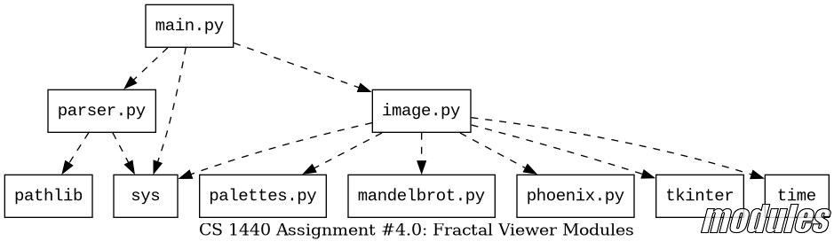
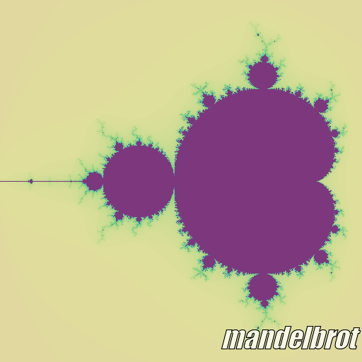
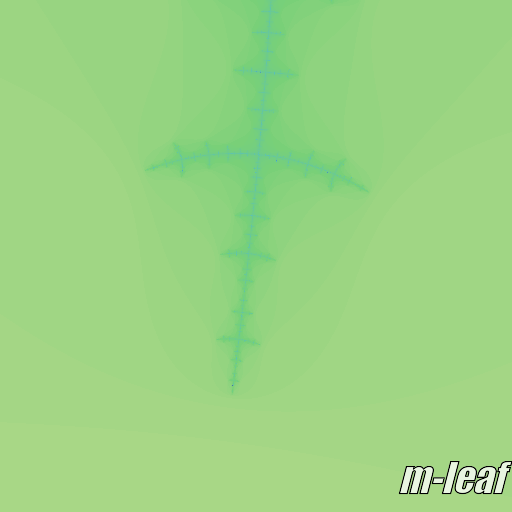
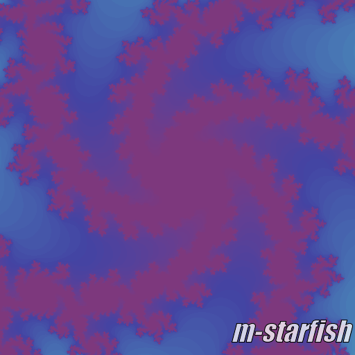
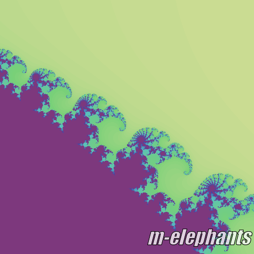
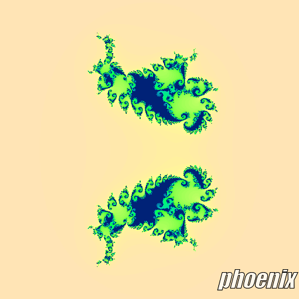
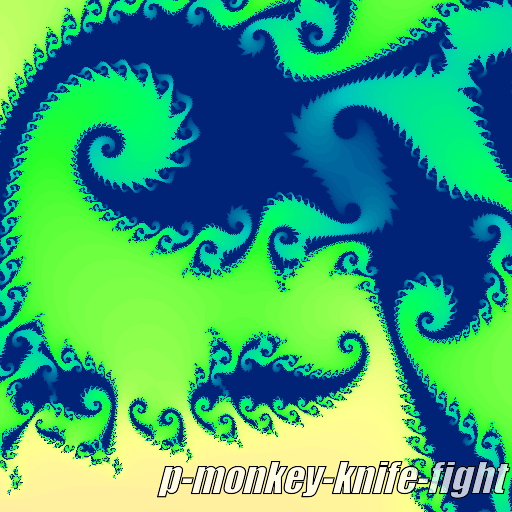

# CS 1440 Project 4.0: Refactoring - Project Requirements

In this sprint you will refactor this program into a cleaner form while keeping the *original functionality* intact.  Resist the urge to improve this program in any way that would be noticed by a user!  Pure refactoring is about *preserving* existing functionality, even if that functionality is incorrect.  In the next sprint (Project 4.1) you will complete this project by enhancing the system with new capabilities.

_Do not go looking for some cleverly-hidden bug; there are no Easter-eggs.  Refactor the starter code with the assumption that it works correctly._

*   [Write A User's Manual](#write-a-users-manual)
*   [User Interface](#user-interface)
*   [Identify Code Smells](#identify-code-smells)
*   [Improve Readability](#improve-readability)
*   [Separate Code Into Modules](#separate-code-into-modules)
*   [Fractal Configuration Files](#fractal-configuration-files)
*   [Testing](#testing)
*   [Program Performance](#program-performance)
*   [Output Examples](#output-examples)


## Write A User's Manual

Begin the project by writing a user's manual describing the user interface of the program.  A good manual describes *only* parts of the program a user will see.  Details about the source code and explanations of how the program works are inappropriate.  Write the manual to target individuals who are familiar with computers, but who are not Python coders.  You may assume that the user knows how to open a terminal, navigate in the shell, and clone the program.  Your audience includes end users, QA testers, sales personnel, and technical support staff.  The manual should cover these topics:

0.  How to launch the program
1.  How to exit the program
2.  A list of fractal files that are compatible with this version of the program
3.  Examples of good and bad runs of the program
    *   Show what the user will see when the program works correctly
    *   List common errors and along with corrective steps to take

Instructions that you *do not* need to give include:

0.  How to install the program
1.  How to open a terminal and navigate to the project directory


A user's manual differs from the Software Development Plan in that it *should not*:

*   Include details about *how* the program works
*   Describe the algorithms and data structures the program uses
    *   For instance, you may name the fractal algorithms involved, but you do not need to go into any more detail than that


You can use AI tools to help you write the manual.  If you do this, include a statement saying so, and make sure the instructions match the program!

Commit your user's manual in the file `doc/Manual.md`.  Your manual should be brief; this means around 4096 bytes.  You can use `ls -l` to see how many bytes your manual contains.  The starter text in `Manual.md` is 695 bytes long:

```bash
$ ls -l doc/Manual.md
-rw-r--r-- 1 fadein fadein 695 Nov  5 09:41 doc/Manual.md
```


## User Interface

The starter code is runnable out-of-the-box.  If it doesn't work on your computer, check [the Tkinter document](./instructions/4.0-Tkinter.md) for instructions.  If you still have trouble, contact DuckieCorp management with a bug report.

The starter code provides three Python programs:

0.  `src/mbrot_fractal.py` draws images of the Mandelbrot set
1.  `src/phoenix_fractal.py` draws images of the Phoenix set
2.  `src/run_tests.py` launches the unit tests

The two "main" programs take the name of a *fractal configuration file* as an argument.  Fractal configuration files are located in the [data/](./data/README.md) directory.  There are some files there that don't work well with these programs.  The list of incompatible fractal configuration files wasn't provided by our client, so you will need to figure them out on your own and provide the list in the **user's manual**.  Do not delete the incompatible files; they will be used in the next sprint.

When you launch the program, a window opens, and a fractal image is drawn from top to bottom.  When the drawing is complete, a copy of the image is saved as a PNG file in the current directory.  Close the window to exit the program.

Preserve the original user interface.  The starter code is run through the files `phoenix_fractal.py` and `mbrot_fractal.py`.  While you will write a new `main.py` this sprint, the program will not be launched that way yet.


### Examples

This command draws a fractal using the Mandelbrot algorithm according to the parameters store in the file `data/mandelbrot.frac`:
*(You may need to use `python3` instead of `python` on your system)*

```
$ python src/mbrot_fractal.py data/mandelbrot.frac
Rendering mandelbrot fractal
[100% =================================]
Done in 1.123 seconds!
Saved image to file mandelbrot.png
Close the image window to exit the program
```

This command uses the Phoenix algorithm to draw a picture called "Monkey Knife Fight":

```
$ python src/phoenix_fractal.py data/p-monkey-knife-fight.frac
Rendering monkey-knife-fight fractal
[100% =================================]
Done in 3.486 seconds!
Saved image to file p-monkey-knife-fight.png
Close the image window to exit the program
```

The example above used a *relative path* to specify the data file.  The program must also accept *absolute paths*.  This is easy to test - just add the string `$PWD/` to the front of the file's path:

```
$ python src/phoenix_fractal.py $PWD/data/p-monkey-knife-fight.frac
Rendering monkey-knife-fight fractal
[100% =================================]
Done in 3.486 seconds!
Saved image to file p-monkey-knife-fight.png
Close the image window to exit the program
```

If you run one of these programs with an incompatible type of fractal, a warning message is displayed.  The resulting image may not be interesting:

```
$ python src/phoenix_fractal.py data/s-island.frac
Warning! incompatible fractal type detected: 'spider'
Rendering s-island fractal
[100% =================================]
Done in 2.018 seconds!
Saved image to file s-island.png
Close the image window to exit the program
```

When you run one of the programs with no arguments, it exits with an error message:

```
$ python src/phoenix_fractal.py
Please provide the name of a fractal as an argument
Usage: src/phoenix_fractal.py FRAC_FILE
```

When a non-existent or inaccessible file is named, let `open()` raise an exception:

```
$ python src/phoenix_fractal.py data/DOES_NOT_EXIST.frac
Traceback (most recent call last):
  File "/tmp/cs1440-proj4/src/phoenix_fractal.py", line 457, in <module>
    _,c=p(sys.argv[1])
  File "/tmp/cs1440-proj4/src/phoenix_fractal.py", line 335, in p
    F = open(f)  # open the file
FileNotFoundError: [Errno 2] No such file or directory: 'data/DOES_NOT_EXIST.frac'
```


## Identify Code Smells

The starter code is intentionally hard to follow, and will take time to understand.  Start early.  This program will begin to make sense as you read and rewrite it.

Use all of the tools at your disposal:

*   Rewrite the *Mandelbrot* and *Phoenix* algorithms in simplified pseudocode
    *   Save this in Phase 1 of `doc/4.0-Plan.md`
    *   You can use ChatGPT to help with this; cite it as a source in your Plan
*   The starter code works correctly
    *   If there are bugs, you must have put them there!
*   Make frequent, small commits in Git
    *   Test your changes before making each commit
    *   Then, you can discard your changes when you make a mistake
*   This program creates PNG images as a side-effect
    *   Make backups of these images *before* you modify the code
    *   This way you can [compare the program's output](#integration-tests) before and after your changes


Catalog *some* of the code smells you encounter in `doc/Smells.md`.

0.  There are **10** types of code smell named in the document.
    *   You must find at least **one** instance of each.
    *   You *may* write more, but this is not a requirement.
1.  For each instance of smelly code, name the file and the general location it was found.
2.  Quote a snippet of the offending source code.
3.  Explain why the passage of code is not very good.
4.  Describe how you will fix it.

[doc/Smells.md](../doc/Smells.md) has a list of the **10** code smells that you will find along with a template that you will fill out.


## Improve Readability

After identifying the code smells, these are some things you can do to make the code easier to read and understand:

*   Erase or rewrite misleading comments.
*   Rename variables with bad names.
*   The functions' signatures aren't set in stone.
    *   If it makes sense to you to change a function's signature, go for it.
*   Simplify confusing constructs
    *   Remove or update comments which are no longer accurate or relevant
    *   Replace hard-coded magic numbers with well-named variables
    *   Rename carelessly-named variables so that the code is self-documenting
    *   Observe how data flows throughout the program and rewrite functions such that global variables are no longer necessary
*   Remove dead code
    *   You begin this sprint with two overlapping modules that contain redundant code.
        *   Identify passages of code that perform essentially the same tasks and rewrite them so that duplication is eliminated.
        *   But don't take this too far; if it takes three new lines of code to liberate one duplicated line, you're doing it wrong.
    *   When you find variables that are unused by a function, remove them
    *   When you find lines of code that have no effect, remove them
    *   Assignments to variables  _after_  they are read for the last time are unnecessary
    *   Code positioned after a return statement will never be reached, and can be deleted
    *   Function parameters that are unused in the body of a function can be deleted
    *   Functions that are never called can be deleted
*   Follow the *Single Responsibility Principle*
    *   Functions deal with as few concepts as possible
    *   Identify functions which have too many responsibilities and split them into smaller pieces which are focused on one task
    *   Begin by identifying the inputs and outputs of each function
    *   The iteration count functions which define the fractals should not be concerned about which color a particular pixel will be; that combines two different responsibilities in a way that is not helpful.
        *   These functions must return only the iteration count, not colors!
    *   Reduce the number of `import` statements in each module to the minimum absolutely required to not crash.
        *   For example, all image creation and display operations should take place in  `image.py`.  No other module needs to import anything from `Tk`.


## Separate Code Into Modules

You begin this sprint with two programs and a unit test script.

0.  Run `mbrot_fractal.py` to render an image of the *Mandelbrot set* fractal.
1.  Run `phoenix_fractal.py` to render an image of the *Phoenix* fractal.

By the end of the sprint you will have an organized *modular* program which retains the original interface.  In other words, users of the program will be unable to tell that the program has changed from observing its behavior.  Each module encapsulates one aspect of the program.  Re-organizing the code in this sprint will set you up for success in the next sprint.

It is good enough for each file to be a collection of *functions*, *constants* and *variables*.  You *may* use classes, but this is not a requirement.  Applying Object-Oriented techniques is the goal of the next sprint.

In the end, your project should include these nine files:

0.  `main.py` - defines a function called `main()`, but is **not** the file a user runs to launch the program.
    *   The program is launched by running `mbrot_fractal.py` or `phoenix_fractal.py`; these files then call the `main()` function defined in `main.py`.
        *   If `main.py` is executed directly, it *must* exit with this error message:
            ```
            Please run either mbrot_fractal.py or phoenix_fractal.py
            ```
    *   `main()` inspects the program's command-line arguments and quits if no arguments are given.
    *   `main()` chooses the fractal algorithm and palette corresponding to user's command.
    *   More details about how this works are below.
1.  `mbrot_fractal.py` - the executable that renders an image of the *Mandelbrot set* fractal.
    *   Calls the `main()` function defined in `main.py`.
    *   *This file may be identical to `main.py`.*
2.  `phoenix_fractal.py` - the executable that renders an image of the *Phoenix* fractal.
    *   Calls the `main()` function defined in `main.py`.
    *   *This file may be identical to `main.py`.*
3.  `parser.py`
    *   Reads fractal configuration from files provided by the user.
    *   Reports errors encountered in the input data.
    *   Returns a dictionary of fractal parameters.
4.  `palettes.py`
    *   A palette is an array of strings representing colors.
    *   This file defines two palettes, one used for Mandelbrot images and one for Phoenix images.
    *   The iteration count returned by the fractal algorithms is used to index into this array
    *   The `count()` functions must never return an out-of-bounds index.
5.  `mandelbrot.py`
    *   Defines a function `count()` that converts a coordinate in the complex plane to an **iteration count** of the Mandelbrot algorithm.  The function's signature could be as simple as:
    ```python
    def count(c : complex, max_iterations : int) -> int
    ```
    *   This function does not know about colors or palettes.
6.  `phoenix.py`
    *   Defines a function `count()` that converts a coordinate in the complex plane to an **iteration count** of the Phoenix algorithm.  The Phoenix algorithm needs two more pieces of information than the Mandelbrot algorithm.  This function's signature could look like this:
    ```python
    def count(z : complex, max_iterations : int, c : complex, phoenix : complex) -> int
    ```
    *   Alternatively, you might choose to pass the entire fractal dictionary into the function so as to reduce the number of parameters:
    ```python
    def count(z : complex, max_iterations : int, fractal : dict) -> int
    ```
    *   This function does not know about colors or palettes.
7.  `image.py`
    *   Creates a `Tk` window and a `PhotoImage` object
    *   The `PhotoImage` object stores the pixels of the image
    *   This module contains code capable of creating a PNG image file
    *   This is the only file which may import `tkinter` and directly use any code from `tkinter`
8.  `run_tests.py`
    *   A helper script for running unit tests
    *   In the beginning of the project this script includes the tests from `src/tests/test_assertions.py.  These tests are provided for your reference, and do **not** count towards your goal of 10 unit tests.


The relationship between `main.py`, `mbrot_fractal.py` and `phoenix_fractal.py` deserves some more explanation.  For most programs, a file named `main.py` indicates the **main entry point**.  However, in this project we need to preserve the *original user interface*. This means that we will keep the old names for now.  There are three outcomes to account for:

0.  `$ main.py FRACTAL` exits with the message: `Please run either mbrot_fractal.py or phoenix_fractal.py`.
    *   This is easily achieved with `if __name__ == "__main__"`.
1.  `$ mbrot_fractal.py FRACTAL` calls `main()` to render `FRACTAL` with the Mandelbrot algorithm and its color scheme.
2.  `$ phoenix_fractal.py FRACTAL` calls `main()` to render `FRACTAL` using the Phoenix algorithm, etc.


There are two ways to achieve this:

0.  Define `main()` to take a parameter `fractal_type`.  Then `phoenix_fractal.py` can be as simple as this:
    *   ```python
        #!/usr/bin/env python3
        import main

        main.main("phoenix")  # change to "mbrot" in mbrot_fractal.py
        ```
1.  Instead of taking a parameter, `main()` can look for the strings `"mbrot"` and `"phoenix"` in `sys.argv[0]`.  If you take this approach:
    *   The files `main.py`, `mbrot_fractal.py` and `phoenix_fractal.py` can all be the same!
    *   Don't use `.startswith()` to detect `"mbrot"` and `"phoenix"`
        *   Instead, use the `in` operator, like this: `"mbrot_fractal" in sys.argv[0]`.
        *   The reason is that when the program is launched as `python src/mbrot_fractal.py FRACTAL`, then `sys.argv[0]` is `"sys/mbrot_fractal.py"`, which *does not* start with `mbrot_fractal`.


A few other points:

*   *Mind the capitalization of file names*
    *   Windows users may get away with it, but your code **will break** in macOS and Linux!
*   You are allowed to create other modules, but you don't need to.
*   Strive to use as few import statements as possible.  This diagram shows the relationship between these modules:
    *   


## Fractal Configuration Files

The image painter creates images of fractal according to parameters defined in fractal configuration files.  These files are specified on the command line and processed by a function called a *parser*.  The parser translates text from fractal configuration files into a dictionary that is passed to functions that need this information.

The parser functions in the starter code ignore many data points present in the files.  This is fine for now; in the next sprint you will enhance the parser to capture more details.


### Fractal Configuration File Format

Fractal configuration files are simple line-oriented text files with one property/value pair per line.  Properties are delimited from values with a colon `:`, which is easy to convert into a dictionary.  Study the files in the [../data/](../data/) and [../invalid/](../invalid/) directories to understand the format.  Names of fractal configuration files typically end in `.frac`, but this is *not required*.  Your program must accept files with *any* name.

Here are some features of the parsers:

*   Fractal configuration files are processed one line at a time, the same as we've done all semester long
*   Lines starting with `#` are ignored
*   Blank lines are ignored
*   All white space is disregarded
*   Properties are stored in a dictionary, and can appear in any order
*   If a property is repeated, the *last one* overrides what came before
*   Lines of text are converted to lowercase before further processing, making the files case insensitive
    *   Ex.  `axislength`  ==  `axisLength` ==  `AXISLENGTH`
*   Property names are separated from values with a colon `:`
    *   White space around the `:` is *optional*
    *   It is an error if no word comes before a `:`
    *   It is an error if nothing follows a `:`
*   The names of recognized properties, along with their data types, are listed below
    *   It is an error when *required* items are missing
    *   The presence of an unrecognized or misspelled property is **NOT** an error
    *   Numeric values should *not* be converted from their string form with `eval()`!

There is one important fact about a fractal that does not appear inside the file; the *stem* of the file's name becomes the name of the image file that is saved after the fractal is drawn.  The file *stem* is accessed with Python's `pathlib.Path` module.


#### Fractal property data types

Property name | Data type | Description
--------------|:---------:|----------------------------------------------------------------
`name`        | str       | The "stem" of the fractal file name
`type`        | str       | Identifies which fractal algorithm is to be used with this data
`iterations`  | int       | Less than or equal to the length of the palette
`pixels`      | int       | Size of the image, in pixels
`axislength`  | float     | Size of the image, in complex units
`centerx`     | float     | Center coordinate of image along the X/Real axis
`centery`     | float     | Center coordinate of image along the Y/Imaginary axis
`creal`       | float     | Used by Julia and Phoenix fractals
`cimag`       | float     | Used by Julia and Phoenix fractals
`preal`       | float     | Used by Phoenix fractals
`pimag`       | float     | Used by Phoenix fractals


The meaning of these properties are illustrated in these images:

##### data/mandelbrot.frac


##### data/mandelbrot-zoomed.frac


## Testing

The starter code has eight (8) unit tests.  You will improve the coverage of tests by adding at least two (2) new unit tests, bringing the total up to ten (10).  Some tests in the starter project aren't really helpful.  Others must be rewritten when you alter the programs.

Detailed instructions about running unit tests are in the document [Running Unit Tests](./4.0-Running_Unit_Tests.md).

*   100% of your unit tests must pass.
*   Your tests must pass when run in a shell from the `src/` directory, like this:
    *   ```bash
        $ cd src
        $ python3 run_tests.py
        ```
    *   If the unit tests run in the shell, **do not worry** about any squiggles or warnings that PyCharm shows you.
    *   The *only* thing that matters is that your tests run from the shell.  **Don't break the tests just to make PyCharm happy.**
*   The example tests in `src/tests/test_assertions.py` **do not count** towards the total of 10 tests.
    *   These tests are provided for reference.
    *   Remove the example tests from `src/run_tests.py` before your submission so their output isn't mixed in with that of the useful tests.
*   Unit tests that exercise useless code **do not count** and should be removed.
    *   Not all of the tests in the starter code exercise useful functions.
    *   For example, don't create a new function in your application which serves no useful purpose to increase the number of passing tests.


### I Have No Idea What To Test!

The purpose of a unit test is to alert you when your program unexpectedly fails.  Here are some test ideas:

*   Color palettes have the expected length
*   Color palettes contain strings instead of some other type of data
*   A fractal's `count()` function returns *int* instead of something else
*   Test the parser function; copy an existing fractal file into `src/tests/` to ensure it is always available for your test
    *   The parser raises `FileNotFoundError` when it attempts to open a non-existent file
    *   The parser raises other exceptions as expected
    *   The dictionary returned by the parser contains the expected contents


### Integration Tests

Integration testing is done by analyzing the image files left behind by the program.

*   Make samples of the output images generated by the starter code *before* you make any changes to it.
    *   As you refactor the fractal algorithms your program should *always* produce identical images.
    *   When an output image differs from before, you will know you have made a mistake.
    *   There are pictures at the bottom of this document
        *   Because I've overlaid the image's title onto these pictures, they are not identical to the program's output
        *   You really need to make your own copies!
*   How can you tell if an image has changed?
    1.  Use your eyeballs.  Open *before* and *after* images in a picture viewer that lets you quickly flip back and forth to spot differences
        *   If you are colorblind/color deficient and struggle to distinguish some of the colors, contact the instructor so this can be taken into account when grading
    2.  Use the `cmp` program to compare two image files on the command line.  This is what you will see when files differ:
        *   ```
            $ cmp mandelbrot.png before/mandelbrot.png
            mandelbrot.png before/mandelbrot.png differ: byte 99, line 3
            ```
        *   No output is printed when the files are identical


## Program Performance

This program isn't going to win any races.  The equivalent C++ program is literally 10,000x faster than this one, generating a fractal in the blink of an eye.  There just isn't a lot of room for improvement without switching to a different programming language.  Making this program run faster isn't a high priority for you.  It is more important that you arrive at a clean, readable and maintainable solution than a fast one.

An additional complication is that the speed of this program is influenced by external factors that are not easy to change, such as your CPU and your operating system.  As much as I would like you to all switch to Linux, this is not feasible.

Instead, I provide this rough guide to the render times of each fractal so you can know what to expect.  If your computer is on the slow side, you should do most of your testing with the "fast" fractals.  The speed of each fractal in the table is proportional to the render time of `mandelbrot`; numbers less than one are faster than `mandelbrot`.

| Fractal              | Proportion of mandelbrot
|----------------------|-------------------------
| m-leaf               | 0.76x
| phoenix              | 0.81x
| **mandelbrot**       | **1.00x**
| p-monkey-knife-fight | 1.29x
| m-starfish           | 2.94x
| m-elephants          | 3.06x


## Output Examples

The following are *some* of the images the starter code is capable of creating.  As you refactor the program ensure that its output continues to match these samples in terms of size and color.

These sample images include the fractal's name in a watermark, making direct comparison with the program's output impossible.  Create your own gallery *before* you refactor.


### data/mandelbrot.frac

```bash
$ python src/mbrot_fractal.py data/mandelbrot.frac
```




### data/m-leaf.frac

```bash
$ python src/mbrot_fractal.py data/m-leaf.frac
```




### data/m-starfish.frac

```bash
$ python src/mbrot_fractal.py data/m-starfish.frac
```




### data/m-elephants.frac

```bash
$ python src/mbrot_fractal.py data/m-elephants.frac
```




### data/phoenix.frac

```bash
$ python src/phoenix_fractal.py data/phoenix.frac
```




### data/p-monkey-knife-fight.frac

```bash
$ python src/phoenix_fractal.py data/p-monkey-knife-fight.frac
```




### data/p-oriental-dragons.frac

```bash
$ python src/phoenix_fractal.py data/p-oriental-dragons.frac
```


